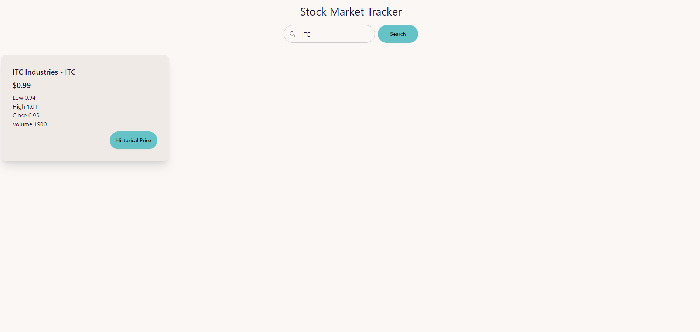

# Stock Market Tracker

This repository comprises three distinct projects, each serving a specific purpose.

# StockMarketTracker.API

**Description:**
C# .NET Restful API designed to manage stock data and implement business logic. The API offers three endpoints to:

1. Get all stocks.
2. Get stocks filtered by criteria.
3. Retrieve historical stock data.

**Architecture:**
The API follows a three-layer architecture:

- **Controller:** Handles HTTP requests.
- **Business Layer:** Manages application logic.
- **Repository Layer:** Interacts with databases and data sources.

**Key Features:**

- Adheres to clean code principles and SOLID patterns.
- Utilizes AutoMapper for seamless conversion between Data domain models and data transfer objects.
- Configurable to external dependencies, such as database connections.
- Implements a scalable and flexible design for adding or modifying features.

**Database and ORM:**

- SQL Server is used for storing stock and historical price data.
- Dapper serves as the ORM in the repository layer.

**Unit Testing:**

- MSTest framework for unit tests.
- Moq for mocking interfaces.
- Limited test cases added due to time constraints.

**Logging:**

- Default logger configured to log in the console.
- External loggers can be easily integrated through program.cs startup code.

**Swagger UI:**

- API documented and accessible through Swagger UI.

**Solution Structure:**

**Database Mock Data - SQL Server:**

- 

---

# StockMarketTracker.Client

**Description:**
React JS client with a single-page application for tracking stock data. Key features include a search bar for stock lookup, live price updates from a mock price stream server via WebSocket connection, and a Redux pattern for state management.

**Key Features:**

- Search bar for searching stocks by name.
- Real-time stock price updates with websockets.
- Subscription to real-time prices **only for searched stocks**.
- Redux pattern with custom hooks for enhanced scalability.
- React Query library for API data management using SWR (stale while revalidate).
- TypeScript for type safety.
- Tailwind CSS + Daisy UI for an aesthetically pleasing UI with theming.
- Recharts for data visualization.

**To-Do:**

- Implement unit tests and logging.

**Screenshots:**

- Stocks screen with stock details:
- 
- Search function (Server side filter)
- 

**Stock chart for historical stock price:**

- 
- 

---

# StockMarketTracker.PriceStreaming

**Description:**
Node.js server with WebSocket functionality for mocking real-time stock price streams.

**Setup:**

1. Install Node.js.
2. Run `npm install`.

**Run the Server:**
Execute `node index.js` to start the WebSocket server on port 4321 (`ws://localhost:4321`).

**WebSocket Server:**

- Listens for WebSocket connections on port 4321.
- Logs connection and disconnection events.
- Generates mock stock data upon receiving a message from the client.

**Mock Data Generation:**

- Generates a JSON string with a timestamp and an array of stock prices.
- `generateDayStockPrice` function calculates new stock prices based on the last day's price and specified volatility.

**Example Usage:**

1. Connect to the WebSocket server using a WebSocket client.
2. Send a JSON array of stock data to the server.
3. Receive simulated stock data in response.

---
